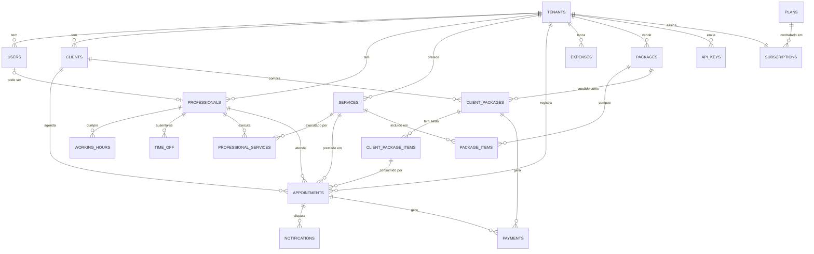
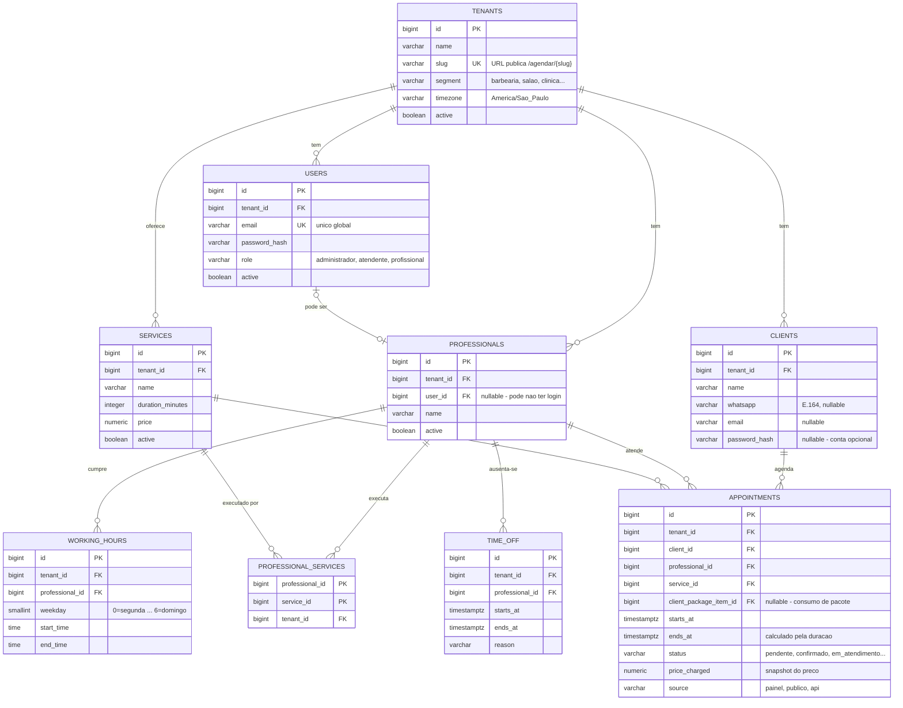
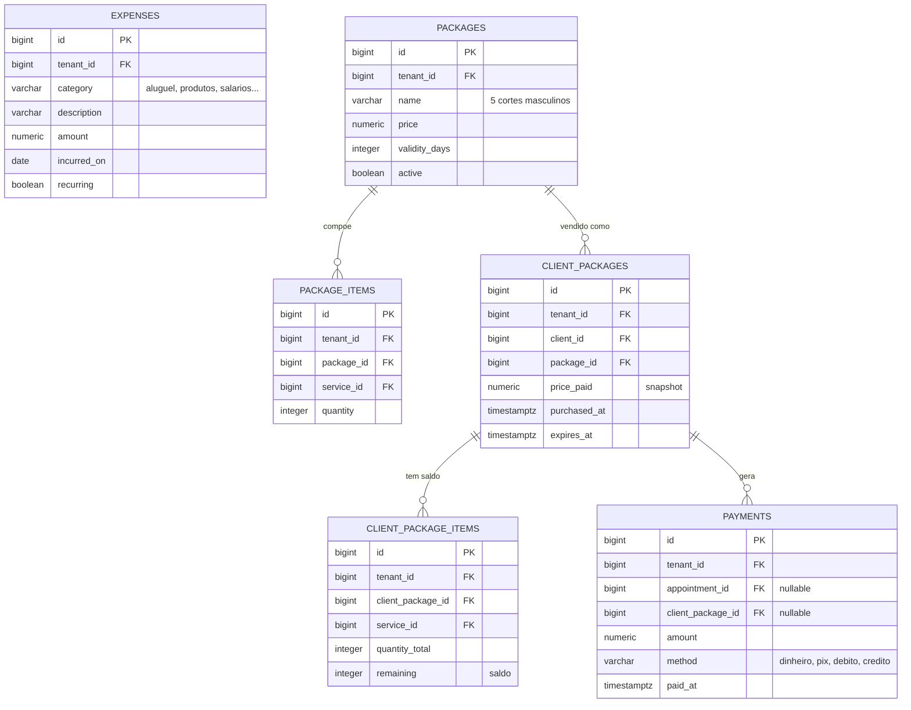
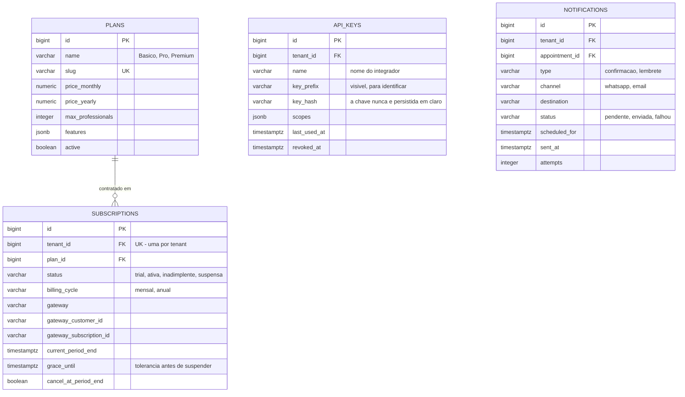

# Modelagem do banco de dados — Agennix

> Agennix é um sistema de agendamento para estabelecimentos de serviço por hora
> marcada — barbearias, salões, clínicas, estúdios, consultórios. O modelo é
> genérico: *profissional*, *serviço* e *agendamento* servem a qualquer
> segmento. O ramo de atuação é apenas um campo em `tenants.segment`.

**Banco:** PostgreSQL 16 · **ORM:** SQLAlchemy 2.0 + Flask-SQLAlchemy · **Migrations:** Alembic (Flask-Migrate)

| Seção | Conteúdo |
|---|---|
| [1](#1-estratégia-de-multitenancy) | Estratégia de multitenancy |
| [2](#2-diagrama-er) | Diagrama ER |
| [3](#3-dicionário-de-dados) | Dicionário de dados (19 tabelas) |
| [4](#4-constraints-e-índices) | Constraints e índices |
| [5](#5-matriz-de-rastreabilidade) | Matriz de rastreabilidade — critério de aceitação → tabela/coluna |

---

## 1. Estratégia de multitenancy

Existem três formas de isolar os dados de cada estabelecimento:

| | **Coluna `tenant_id`** | Schema por tenant | Banco por tenant |
|---|---|---|---|
| Isolamento | Lógico (código + constraints) | Médio (`SET search_path`) | Físico, total |
| Cadastrar cliente novo | `INSERT` numa tabela | `CREATE SCHEMA` + migrations | Provisionar banco |
| Rodar migrations | Uma vez | N schemas, uma a uma | N bancos |
| Relatório da plataforma | `GROUP BY tenant_id` | Trabalhoso | Quase inviável |
| Custo de infra | Baixo | Médio | Alto |
| Risco principal | Query sem filtro vaza dados | Baixo | Praticamente nulo |

**Escolha: coluna `tenant_id`.** Um único banco, um único schema. É o padrão da
indústria para SaaS deste porte — migrations rodam uma vez, o onboarding de um
estabelecimento novo é um `INSERT`, e qualquer métrica agregada da plataforma é
um `GROUP BY`.

O risco dessa abordagem é concreto: **esquecer um `WHERE tenant_id = ...`** vaza
dados entre clientes. Ele é endereçado por construção, não por disciplina:

1. **FK composta** — misturar tenants vira erro de integridade referencial
   ([seção 4.3](#43-isolamento-multitenant-por-fk-composta));
2. **Ponto único de acesso** — `backend/app/utils/tenant.py` é por onde todas as
   queries de negócio passam, aplicando o filtro automaticamente.

A única tabela sem `tenant_id` é `plans`, e isso é proposital: ela é o catálogo
de produto **da plataforma** (os planos que a Agennix vende aos
estabelecimentos), compartilhado por todos. O vínculo "estabelecimento X assinou
o plano Pro" mora em `subscriptions`, essa sim com `tenant_id`.

```
plans (global)                  subscriptions (por tenant)
  id: 2                           tenant_id: 42  ──> Barbearia do João
  name: "Pro"          <────────  plan_id: 2
  price_monthly: 199              status: ativa
```

> **Não confundir** com `packages`: aqueles são os pacotes que o
> *estabelecimento* vende aos *clientes dele* ("5 cortes por R$ 150"). Esses têm
> `tenant_id`.

---

## 2. Diagrama ER

### 2.1 Visão geral



### 2.2 Núcleo e agenda



### 2.3 Financeiro e pacotes



### 2.4 SaaS e integrações



---

## 3. Dicionário de dados

**Convenções aplicadas a todas as tabelas:**

- `id BIGSERIAL PRIMARY KEY`
- `tenant_id BIGINT NOT NULL REFERENCES tenants(id)` em toda tabela de negócio (exceto `plans`)
- `created_at`, `updated_at` — `TIMESTAMPTZ NOT NULL DEFAULT now()`
- Valores monetários — `NUMERIC(10,2)`, nunca `float`
- Instantes — `TIMESTAMPTZ` (com timezone); horários de expediente — `TIME` (sem data)
- Enums — `VARCHAR` + `CHECK`, não tipo `ENUM` do Postgres (acrescentar valor a um `ENUM` exige `ALTER TYPE`, o que complica migrations)

### 3.1 `tenants` — estabelecimento

| Coluna | Tipo | Nulo | Default | Descrição |
|---|---|---|---|---|
| `id` | bigserial | não | — | PK |
| `name` | varchar(120) | não | — | Nome do estabelecimento |
| `slug` | varchar(60) | não | — | **Único.** URL pública: `/agendar/{slug}` |
| `segment` | varchar(30) | não | `'outro'` | `barbearia`, `salao`, `clinica`, `estudio`, `consultorio`, `outro` |
| `email` | varchar(180) | sim | — | Contato do estabelecimento |
| `whatsapp` | varchar(20) | sim | — | Formato E.164 |
| `address` | varchar(255) | sim | — | Endereço |
| `timezone` | varchar(50) | não | `'America/Sao_Paulo'` | Fuso para cálculo de agenda |
| `active` | boolean | não | `true` | Desativa sem apagar |

### 3.2 `users` — quem faz login no painel

| Coluna | Tipo | Nulo | Default | Descrição |
|---|---|---|---|---|
| `id` | bigserial | não | — | PK |
| `tenant_id` | bigint | não | — | FK → `tenants` |
| `name` | varchar(120) | não | — | Nome |
| `email` | varchar(180) | não | — | **Único global** (ver [4.4](#44-usersemail-único-global)) |
| `password_hash` | varchar(255) | não | — | `werkzeug.security` |
| `role` | varchar(20) | não | — | `administrador`, `atendente`, `profissional` |
| `active` | boolean | não | `true` | Bloqueia login sem apagar o histórico |
| `last_login_at` | timestamptz | sim | — | Auditoria |

### 3.3 `clients` — cliente final

| Coluna | Tipo | Nulo | Default | Descrição |
|---|---|---|---|---|
| `id` | bigserial | não | — | PK |
| `tenant_id` | bigint | não | — | FK → `tenants` |
| `name` | varchar(120) | não | — | Nome |
| `whatsapp` | varchar(20) | sim | — | E.164. **Único por tenant** quando preenchido |
| `email` | varchar(180) | sim | — | Alternativa para quem não tem telefone |
| `password_hash` | varchar(255) | sim | — | **Nullable** — conta opcional, criada depois |
| `notes` | text | sim | — | Observações do atendimento |

`CHECK (whatsapp IS NOT NULL OR email IS NOT NULL)` — garante ao menos uma forma de contato.

### 3.4 `professionals` — quem presta o atendimento

| Coluna | Tipo | Nulo | Default | Descrição |
|---|---|---|---|---|
| `id` | bigserial | não | — | PK |
| `tenant_id` | bigint | não | — | FK → `tenants` |
| `user_id` | bigint | **sim** | — | FK → `users`. Nulo = profissional sem acesso ao sistema |
| `name` | varchar(120) | não | — | Nome exibido na agenda |
| `nickname` | varchar(60) | sim | — | Como o cliente o conhece |
| `phone` | varchar(20) | sim | — | Contato interno |
| `active` | boolean | não | `true` | Remove da agenda sem apagar o histórico |

### 3.5 `services` — o que é oferecido

| Coluna | Tipo | Nulo | Default | Descrição |
|---|---|---|---|---|
| `id` | bigserial | não | — | PK |
| `tenant_id` | bigint | não | — | FK → `tenants` |
| `name` | varchar(120) | não | — | Ex: "Corte masculino" |
| `description` | text | sim | — | Detalhamento |
| `duration_minutes` | integer | não | — | **Alimenta o cálculo de `ends_at`.** `CHECK > 0` |
| `price` | numeric(10,2) | não | — | Preço de tabela. `CHECK >= 0` |
| `active` | boolean | não | `true` | Tira do catálogo sem apagar o histórico |

### 3.6 `professional_services` — quem executa o quê

| Coluna | Tipo | Nulo | Descrição |
|---|---|---|---|
| `professional_id` | bigint | não | FK → `professionals`. PK composta |
| `service_id` | bigint | não | FK → `services`. PK composta |
| `tenant_id` | bigint | não | FK → `tenants` |

Sem preço: a decisão foi preço único por serviço. Esta tabela responde apenas
"quais profissionais posso oferecer para este serviço" na tela de agendamento.

### 3.7 `appointments` — o agendamento

| Coluna | Tipo | Nulo | Default | Descrição |
|---|---|---|---|---|
| `id` | bigserial | não | — | PK |
| `tenant_id` | bigint | não | — | FK → `tenants` |
| `client_id` | bigint | não | — | FK → `clients` |
| `professional_id` | bigint | não | — | FK → `professionals` |
| `service_id` | bigint | não | — | FK → `services` |
| `client_package_item_id` | bigint | sim | — | FK → `client_package_items`. Preenchido quando o atendimento consome saldo de pacote |
| `starts_at` | timestamptz | não | — | Início |
| `ends_at` | timestamptz | não | — | **Calculado:** `starts_at + service.duration_minutes` |
| `status` | varchar(20) | não | `'confirmado'` | `pendente`, `confirmado`, `em_atendimento`, `concluido`, `cancelado`, `nao_compareceu` |
| `price_charged` | numeric(10,2) | não | — | **Snapshot** de `services.price` na criação |
| `source` | varchar(10) | não | `'painel'` | `painel`, `publico`, `api` — de onde veio |
| `notes` | text | sim | — | Observações |
| `created_by_user_id` | bigint | sim | — | FK → `users`. Nulo quando veio do agendamento público |
| `cancelled_at` | timestamptz | sim | — | Quando foi cancelado |
| `cancellation_reason` | varchar(255) | sim | — | Motivo |

### 3.8 `working_hours` — expediente

| Coluna | Tipo | Nulo | Descrição |
|---|---|---|---|
| `id` | bigserial | não | PK |
| `tenant_id` | bigint | não | FK → `tenants` |
| `professional_id` | bigint | não | FK → `professionals` |
| `weekday` | smallint | não | `0` = segunda … `6` = domingo. `CHECK BETWEEN 0 AND 6` |
| `start_time` | time | não | Início do turno |
| `end_time` | time | não | Fim do turno. `CHECK > start_time` |

**Turno partido** é representado por duas linhas no mesmo dia — por exemplo
`(seg, 09:00, 12:00)` e `(seg, 13:00, 18:00)` para um intervalo de almoço.

### 3.9 `time_off` — ausências

| Coluna | Tipo | Nulo | Descrição |
|---|---|---|---|
| `id` | bigserial | não | PK |
| `tenant_id` | bigint | não | FK → `tenants` |
| `professional_id` | bigint | não | FK → `professionals` |
| `starts_at` | timestamptz | não | Início da ausência |
| `ends_at` | timestamptz | não | Fim. `CHECK > starts_at` |
| `reason` | varchar(120) | sim | Férias, médico, feriado |

### 3.10 `payments` — entrada de caixa

| Coluna | Tipo | Nulo | Descrição |
|---|---|---|---|
| `id` | bigserial | não | PK |
| `tenant_id` | bigint | não | FK → `tenants` |
| `appointment_id` | bigint | sim | FK → `appointments`. Pagamento avulso de um atendimento |
| `client_package_id` | bigint | sim | FK → `client_packages`. Venda de pacote |
| `amount` | numeric(10,2) | não | Valor. `CHECK > 0` |
| `method` | varchar(20) | não | `dinheiro`, `pix`, `cartao_debito`, `cartao_credito` |
| `paid_at` | timestamptz | não | Quando o dinheiro entrou |

`CHECK (num_nonnulls(appointment_id, client_package_id) = 1)` — exatamente uma
origem por pagamento.

### 3.11 `expenses` — custos

| Coluna | Tipo | Nulo | Descrição |
|---|---|---|---|
| `id` | bigserial | não | PK |
| `tenant_id` | bigint | não | FK → `tenants` |
| `category` | varchar(30) | não | `aluguel`, `produtos`, `salarios`, `comissao`, `marketing`, `impostos`, `outros` |
| `description` | varchar(255) | não | Descrição do lançamento |
| `amount` | numeric(10,2) | não | Valor. `CHECK > 0` |
| `incurred_on` | date | não | Data de competência |
| `recurring` | boolean | não | Despesa fixa mensal |

### 3.12 `packages` — catálogo de pacotes do estabelecimento

| Coluna | Tipo | Nulo | Descrição |
|---|---|---|---|
| `id` | bigserial | não | PK |
| `tenant_id` | bigint | não | FK → `tenants` |
| `name` | varchar(120) | não | Ex: "5 cortes masculinos" |
| `description` | text | sim | Detalhamento |
| `price` | numeric(10,2) | não | Preço do pacote. `CHECK >= 0` |
| `validity_days` | integer | sim | Validade a partir da compra. Nulo = sem validade |
| `active` | boolean | não | Tira de venda sem apagar o histórico |

### 3.13 `package_items` — o que o pacote cobre

| Coluna | Tipo | Nulo | Descrição |
|---|---|---|---|
| `id` | bigserial | não | PK |
| `tenant_id` | bigint | não | FK → `tenants` |
| `package_id` | bigint | não | FK → `packages` |
| `service_id` | bigint | não | FK → `services` |
| `quantity` | integer | não | Quantas sessões daquele serviço. `CHECK > 0` |

`UNIQUE (package_id, service_id)`.

### 3.14 `client_packages` — a compra

| Coluna | Tipo | Nulo | Descrição |
|---|---|---|---|
| `id` | bigserial | não | PK |
| `tenant_id` | bigint | não | FK → `tenants` |
| `client_id` | bigint | não | FK → `clients` |
| `package_id` | bigint | não | FK → `packages` |
| `price_paid` | numeric(10,2) | não | **Snapshot** do preço na data da compra |
| `purchased_at` | timestamptz | não | Data da compra |
| `expires_at` | timestamptz | sim | `purchased_at + validity_days` |

### 3.15 `client_package_items` — o saldo

| Coluna | Tipo | Nulo | Descrição |
|---|---|---|---|
| `id` | bigserial | não | PK |
| `tenant_id` | bigint | não | FK → `tenants` |
| `client_package_id` | bigint | não | FK → `client_packages` |
| `service_id` | bigint | não | FK → `services` |
| `quantity_total` | integer | não | Copiado de `package_items.quantity` na compra |
| `remaining` | integer | não | Saldo. `CHECK BETWEEN 0 AND quantity_total` |

### 3.16 `plans` — catálogo SaaS da plataforma (sem `tenant_id`)

| Coluna | Tipo | Nulo | Descrição |
|---|---|---|---|
| `id` | bigserial | não | PK |
| `name` | varchar(60) | não | "Básico", "Pro", "Premium" |
| `slug` | varchar(40) | não | **Único** |
| `price_monthly` | numeric(10,2) | não | Mensal |
| `price_yearly` | numeric(10,2) | sim | Anual |
| `max_professionals` | integer | sim | Limite. Nulo = ilimitado |
| `max_appointments_month` | integer | sim | Limite. Nulo = ilimitado |
| `features` | jsonb | não | Lista de recursos para a tabela comparativa da landing page |
| `active` | boolean | não | Plano descontinuado some da landing mas segue valendo para quem já assina |
| `sort_order` | smallint | não | Ordem de exibição |

### 3.17 `subscriptions` — assinatura do estabelecimento

| Coluna | Tipo | Nulo | Descrição |
|---|---|---|---|
| `id` | bigserial | não | PK |
| `tenant_id` | bigint | não | FK → `tenants`. **Único** — uma assinatura por estabelecimento |
| `plan_id` | bigint | não | FK → `plans` |
| `status` | varchar(20) | não | `trial`, `ativa`, `inadimplente`, `suspensa`, `cancelada` |
| `billing_cycle` | varchar(10) | não | `mensal`, `anual` |
| `gateway` | varchar(30) | sim | Provedor de pagamento |
| `gateway_customer_id` | varchar(100) | sim | ID do cliente no gateway |
| `gateway_subscription_id` | varchar(100) | sim | ID da assinatura no gateway |
| `trial_ends_at` | timestamptz | sim | Fim do teste grátis |
| `current_period_start` | timestamptz | não | Início do período pago |
| `current_period_end` | timestamptz | não | Fim do período pago |
| `grace_until` | timestamptz | sim | **Tolerância** após falha de pagamento, antes de suspender |
| `cancel_at_period_end` | boolean | não | Renovação automática cancelada |

### 3.18 `api_keys` — acesso de integradores

| Coluna | Tipo | Nulo | Descrição |
|---|---|---|---|
| `id` | bigserial | não | PK |
| `tenant_id` | bigint | não | FK → `tenants` |
| `name` | varchar(120) | não | Identifica o integrador |
| `key_prefix` | varchar(12) | não | Primeiros caracteres, exibidos no painel |
| `key_hash` | varchar(255) | não | **Hash.** A chave em claro só aparece uma vez, na criação |
| `scopes` | jsonb | não | Permissões concedidas |
| `last_used_at` | timestamptz | sim | Auditoria |
| `expires_at` | timestamptz | sim | Expiração opcional |
| `revoked_at` | timestamptz | sim | Revogação |

### 3.19 `notifications` — mensagens enviadas

| Coluna | Tipo | Nulo | Descrição |
|---|---|---|---|
| `id` | bigserial | não | PK |
| `tenant_id` | bigint | não | FK → `tenants` |
| `appointment_id` | bigint | não | FK → `appointments` |
| `type` | varchar(20) | não | `confirmacao`, `lembrete` |
| `channel` | varchar(20) | não | `whatsapp`, `email` |
| `destination` | varchar(180) | não | Número/e-mail efetivamente usado |
| `status` | varchar(20) | não | `pendente`, `enviada`, `falhou` |
| `scheduled_for` | timestamptz | não | Quando deve sair (lembrete: `starts_at` − antecedência) |
| `sent_at` | timestamptz | sim | Quando saiu |
| `provider_message_id` | varchar(120) | sim | ID na Evolution API |
| `error_message` | text | sim | Diagnóstico da falha |
| `attempts` | integer | não | Tentativas |

---

## 4. Constraints e índices

### 4.1 `appointments.price_charged` — snapshot obrigatório

O preço é copiado de `services.price` no momento da criação do agendamento. Sem
isso, reajustar um serviço corromperia todo relatório financeiro passado: um
corte vendido por R$ 40 em março apareceria como R$ 50 depois do reajuste de
abril. O mesmo vale para `client_packages.price_paid`.

### 4.2 Choque de horário impedido pelo banco

Checar conflito em Python e então inserir abre uma janela de corrida: duas
atendentes salvando ao mesmo tempo criam agendamento duplo. O Postgres resolve
isso definitivamente:

```sql
CREATE EXTENSION IF NOT EXISTS btree_gist;

ALTER TABLE appointments ADD CONSTRAINT appointments_no_overlap
  EXCLUDE USING gist (
    professional_id WITH =,
    tstzrange(starts_at, ends_at) WITH &&
  ) WHERE (status <> 'cancelado');
```

A validação em Python continua existindo — para devolver mensagem amigável ao
usuário — mas a **garantia** fica no banco.

### 4.3 Isolamento multitenant por FK composta

Um `tenant_id` solto não impede um agendamento apontar para um cliente de outro
estabelecimento. A FK composta impede:

```sql
ALTER TABLE clients       ADD CONSTRAINT clients_tenant_id_key       UNIQUE (tenant_id, id);
ALTER TABLE professionals ADD CONSTRAINT professionals_tenant_id_key UNIQUE (tenant_id, id);
ALTER TABLE services      ADD CONSTRAINT services_tenant_id_key      UNIQUE (tenant_id, id);

ALTER TABLE appointments
  ADD CONSTRAINT appointments_client_same_tenant
    FOREIGN KEY (tenant_id, client_id)       REFERENCES clients       (tenant_id, id),
  ADD CONSTRAINT appointments_prof_same_tenant
    FOREIGN KEY (tenant_id, professional_id) REFERENCES professionals (tenant_id, id),
  ADD CONSTRAINT appointments_service_same_tenant
    FOREIGN KEY (tenant_id, service_id)      REFERENCES services      (tenant_id, id);
```

Misturar tenants passa a ser erro de integridade referencial, não bug silencioso.
Aplicar o mesmo padrão em `package_items`, `client_packages`,
`client_package_items`, `working_hours`, `time_off` e `payments`.

### 4.4 `users.email` único global

Único por tenant permitiria o mesmo e-mail em estabelecimentos diferentes — mas
aí o login (e-mail + senha, sem informar o estabelecimento) ficaria ambíguo.
Único global mantém a tela de login simples, ao custo de uma pessoa não poder
reusar o mesmo e-mail em dois estabelecimentos. Trade-off adequado ao MVP.

`clients`, ao contrário, usa `UNIQUE (tenant_id, whatsapp)`: o mesmo cliente
cadastrado em dois estabelecimentos são **dois registros independentes**, que é
exatamente o que o critério 3 da história de multitenant exige.

### 4.5 Receita do pacote na venda — e o que isso implica

A decisão foi **regime de caixa**: pacote de R$ 150 vendido em janeiro entra
inteiro em janeiro. Na prática:

- a venda gera uma linha em `payments` com `client_package_id` preenchido;
- os atendimentos que consomem o pacote **não** geram `payments` — apontam para
  `client_package_item_id` e decrementam `remaining`;
- mas eles **mantêm `price_charged`** com o valor de tabela do serviço.

Isso separa duas perguntas que o dashboard precisa responder sem se contradizer:

| Pergunta | Fonte |
|---|---|
| Quanto entrou no caixa? | `SUM(payments.amount)` |
| Quanto cada profissional produziu? | `SUM(appointments.price_charged)` |

Sem essa separação, o profissional que atende sessões de pacote apareceria com
faturamento zero no relatório por profissional.

### 4.6 Lembrete duplicado

```sql
ALTER TABLE notifications
  ADD CONSTRAINT notifications_unique_per_appointment UNIQUE (appointment_id, type);
```

Se o scheduler rodar duas vezes — reinício do processo, sobreposição de
execuções — a segunda inserção falha em vez de mandar dois WhatsApps ao cliente.

### 4.7 Consumo de pacote: o item tem que bater com o atendimento

`appointments.client_package_item_id` sozinho permite duas incoerências que
nenhuma FK simples detecta:

- consumir um item de **"corte"** num atendimento de **"barba"**;
- consumir o pacote **de outro cliente**.

O mesmo truque de chave composta da [4.3](#43-isolamento-multitenant-por-fk-composta)
resolve os dois. Basta desnormalizar `client_id` em `client_package_items`
(copiado de `client_packages` na compra) e declarar:

```sql
ALTER TABLE client_package_items
  ADD CONSTRAINT cpi_id_service_key UNIQUE (id, service_id),
  ADD CONSTRAINT cpi_id_client_key  UNIQUE (id, client_id);

ALTER TABLE appointments
  ADD CONSTRAINT appointments_package_matches_service
    FOREIGN KEY (client_package_item_id, service_id)
    REFERENCES client_package_items (id, service_id),
  ADD CONSTRAINT appointments_package_matches_client
    FOREIGN KEY (client_package_item_id, client_id)
    REFERENCES client_package_items (id, client_id);
```

Com isso, usar o pacote errado vira erro de integridade referencial. A
desnormalização de `client_id` se paga: é uma coluna redundante em troca de
duas classes inteiras de bug que deixam de ser possíveis.

O saldo continua protegido pelo `CHECK (remaining BETWEEN 0 AND
quantity_total)` — mas o decremento precisa acontecer sob `SELECT ... FOR
UPDATE` na linha de `client_package_items`, senão dois atendimentos concluídos
simultaneamente podem ler o mesmo `remaining` e gravar o mesmo valor
decrementado.

### 4.8 Índices

| Índice | Justificativa |
|---|---|
| `appointments (tenant_id, starts_at)` | Toda consulta de agenda filtra por período |
| `appointments (tenant_id, professional_id, starts_at)` | Dashboard por profissional |
| `appointments (tenant_id, status)` | Filtro por status |
| `payments (tenant_id, paid_at)` | Relatórios financeiros por período |
| `expenses (tenant_id, incurred_on)` | Idem |
| `clients (tenant_id, whatsapp)` | Busca do cliente no agendamento público — já coberto pelo `UNIQUE` |
| `notifications (status, scheduled_for)` | Varredura do job de lembretes |
| `api_keys (key_prefix)` | Lookup da chave a cada requisição da API |

> O índice `EXCLUDE` da seção 4.2 já cria um GiST sobre
> `(professional_id, tstzrange)`, que serve também às consultas de
> disponibilidade.

---

## 5. Matriz de rastreabilidade

Cada critério de aceitação das 12 histórias e onde ele é atendido no modelo.
Critérios puramente de interface não têm contrapartida no banco e estão
marcados como tal — a coluna existe justamente para que isso fique explícito,
não omitido.

### 5.1 Tela de login com autenticação (Flask-Login)

| # | Critério | Onde |
|---|---|---|
| 1 | Validar credenciais e exibir erro | `users.email`, `users.password_hash`, `users.active` |
| 2 | Manter sessão ativa durante a navegação | Sessão em cookie (Flask-Login); `users.last_login_at` registra o acesso |
| 3 | Logout encerra a sessão com segurança | Sem contrapartida no banco — a sessão é destruída no servidor |

### 5.2 CRUD de agendamento (SQLAlchemy)

| # | Critério | Onde |
|---|---|---|
| 1 | Exigir cliente, profissional, data, horário e serviço | `appointments.client_id`, `professional_id`, `service_id`, `starts_at` — todos `NOT NULL` |
| 2 | Alterações salvas imediatamente | Transação por requisição; `updated_at` |
| 3 | Não excluir/alterar agendamento passado sem confirmação | `appointments.starts_at` comparado a `now()` na camada de serviço; exclusão é lógica (`status = 'cancelado'`, `cancelled_at`, `cancellation_reason`) |

### 5.3 Lembretes automáticos no WhatsApp (Evolution API)

| # | Critério | Onde |
|---|---|---|
| 1 | Mensagem com nome do cliente, serviço, profissional, dia e horário | Join `appointments` → `clients.name`, `services.name`, `professionals.name`, `appointments.starts_at` |
| 2 | Envio com antecedência pré-definida | `notifications.scheduled_for` = `starts_at` − `REMINDER_HOURS_BEFORE` |
| 3 | Validar formato do número de WhatsApp | `clients.whatsapp` em E.164, validado por `app/utils/phone.py` |
| — | *(implícito)* Não enviar lembrete duplicado | `UNIQUE (appointment_id, type)` — [4.6](#46-lembrete-duplicado) |

### 5.4 Dashboard de agendamentos

| # | Critério | Onde |
|---|---|---|
| 1 | Filtrar por profissional ou por serviço | `appointments.professional_id`, `service_id` + índices de [4.8](#48-índices) |
| 2 | Status visual de cada agendamento | `appointments.status` |
| 3 | Alternar entre diário, semanal e mensal | `appointments.starts_at` + índice `(tenant_id, starts_at)` |

### 5.5 Sistema de permissão (RBAC)

| # | Critério | Onde |
|---|---|---|
| 1 | Profissional vê apenas os próprios atendimentos e clientes | `users.role = 'profissional'` → `professionals.user_id` → filtro por `appointments.professional_id` |
| 2 | Atendente gerencia a agenda, mas não vê dados financeiros | `users.role = 'atendente'`; `payments` e `expenses` barrados no decorator |
| 3 | Configurações e faturamento restritos ao Administrador | `users.role = 'administrador'` |

### 5.6 Dashboard financeiro

| # | Critério | Onde |
|---|---|---|
| 1 | Filtros diário a anual | `payments.paid_at`, `expenses.incurred_on` + índices |
| 2 | Faturamento por tipo de serviço e por profissional | `appointments.price_charged` agrupado por `service_id` / `professional_id` — ver a distinção de [4.5](#45-receita-do-pacote-na-venda--e-o-que-isso-implica) |
| 3 | Formato monetário com somatório | `NUMERIC(10,2)` em todos os valores; formatação na apresentação |
| — | *(da user story)* "receita bruta, **custos** e crescimento" | `expenses` — a entidade que faltava na primeira versão da estrutura |

### 5.7 Criação de endpoints (Flask-RESTful)

| # | Critério | Onde |
|---|---|---|
| 1 | JSON com status HTTP padronizados | Sem contrapartida no banco — `app/utils/errors.py` e `responses.py` |
| 2 | Toda requisição exige token válido | `api_keys.key_hash`, `revoked_at`, `expires_at`, `scopes` |
| 3 | Rejeitar campos obrigatórios ausentes | Restrições `NOT NULL` + validação em `app/schemas/` |

### 5.8 Atendente criar agendamentos

| # | Critério | Onde |
|---|---|---|
| 1 | Impedir agendamento se o profissional já está ocupado | Constraint `EXCLUDE` — [4.2](#42-choque-de-horário-impedido-pelo-banco) |
| 2 | Cadastrar cliente novo durante o agendamento | `clients` criado na mesma transação do `appointments` |
| 3 | Calcular o horário de término pela duração | `appointments.ends_at` = `starts_at` + `services.duration_minutes` |

### 5.9 Modelagem multitenant

| # | Critério | Onde |
|---|---|---|
| 1 | Toda consulta e registro vinculados ao tenant | `tenant_id NOT NULL` em todas as 18 tabelas de negócio; `app/utils/tenant.py` |
| 2 | Usuário jamais vê ou edita dados de outra unidade | FK composta — [4.3](#43-isolamento-multitenant-por-fk-composta) |
| 3 | Cliente novo não sobrescreve nem mistura dados de outra loja | `UNIQUE (tenant_id, whatsapp)` em `clients` — [4.4](#44-usersemail-único-global) |

### 5.10 Landing page de apresentação e vendas

| # | Critério | Onde |
|---|---|---|
| 1 | Proposta de valor, recursos e depoimentos | **Sem contrapartida no banco** — conteúdo estático em `(marketing)/page.tsx` |
| 2 | Tabela comparativa de planos com CTA | `plans.name`, `price_monthly`, `price_yearly`, `features`, `sort_order` |
| 3 | Layout responsivo e carregamento rápido | **Sem contrapartida no banco** |
| 4 | Canal ou formulário de contato | **Não atendido nesta versão** — exigiria uma tabela `leads`. Avaliar na implementação da landing |

### 5.11 Assinatura e planos recorrentes (SaaS)

| # | Critério | Onde |
|---|---|---|
| 1 | Pagamento recorrente e confirmação da transação | `subscriptions.gateway`, `gateway_customer_id`, `gateway_subscription_id`, `billing_cycle` |
| 2 | Acesso liberado quando a cobrança é confirmada | `subscriptions.status`, `current_period_start`, `current_period_end` |
| 3 | Falha de pagamento → alertar e aplicar tolerância antes de suspender | `subscriptions.status = 'inadimplente'` + `grace_until`; `'suspensa'` ao expirar |
| 4 | Mudar de plano ou cancelar a renovação | `subscriptions.plan_id` e `cancel_at_period_end` |

### 5.12 Agendamento rápido pelo cliente (sem login)

| # | Critério | Onde |
|---|---|---|
| 1 | Sem senha; só nome e telefone | `clients.password_hash` **nullable**; `appointments.source = 'publico'` |
| 2 | Validar o número de WhatsApp | `app/utils/phone.py` + `CHECK (whatsapp IS NOT NULL OR email IS NOT NULL)` |
| 3 | Confirmação automática no WhatsApp | `notifications.type = 'confirmacao'` |
| 4 | Não permitir horários ocupados | `working_hours` − `appointments` − `time_off`, com a constraint `EXCLUDE` como garantia final |

### Resumo

39 critérios de aceitação ao todo:

| Situação | Quantidade |
|---|---|
| Atendidos pelo modelo de dados | 34 |
| Sem contrapartida no banco (interface ou aplicação) | 4 — 5.1.3, 5.7.1, 5.10.1, 5.10.3 |
| **Não atendidos nesta versão** | 1 — formulário de contato da landing page (5.10.4) |

---

## Histórico

| Data | Alteração |
|---|---|
| 2026-10-06 | Versão inicial: 19 tabelas, estratégia multitenant por coluna, rastreabilidade das 12 histórias |
